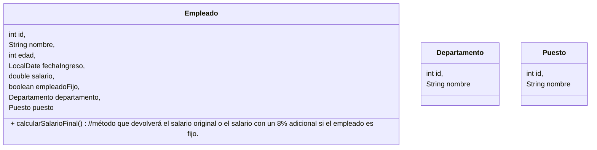

# Enunciado Final

Se solicita desarrollar un programa de consola en Java con menú de opciones que de soporte para la gestión de empleados de una empresa, ejecutable mediante Maven (mvn exec:java), que cumpla con las siguientes características:

1. Modelo de datos

La aplicación manejará las siguientes entidades:



2. Entrada de datos

El programa debe leer un archivo CSV (el cual será provisto junto con el enunciado final), cuyo nombre puede pasarse como parámetro de entrada o estar definido por defecto.
El CSV contendrá información sobre empleados.

3. Base de datos

Se utilizará H2 en memoria como motor de base de datos. Se entregará un script SQL para crear las tablas necesarias junto con este enunciado. El programa deberá ejecutar este script al inicio para inicializar la base.

_Nota:_
Considere utilizar lo siguiente en la definición de la conexión a la DB, dentro del __persistence.xml__:
```
<property name="jakarta.persistence.schema-generation.database.action" value="create"/>
<property name="jakarta.persistence.schema-generation.create-source" value="script"/>
<property name="jakarta.persistence.schema-generation.create-script-source" value="META-INF/db-schema.sql"/>
```

4. Persistencia

El programa debe leer el CSV y popular las tablas de la base de datos con sus registros.

5. Consultas

El programa deberá obtener y mostrar en consola resúmenes de los datos cargados.
Las consignas específicas de consultas se entregarán junto con el enunciado final completo.

# Resultado esperado

Con la información provista, se espera que cada estudiante arme toda la estructura del proyecto, con las clases del modelo provistas utilizando JPA y permitiendo la conexión a la DB de la manera que crea más conveniente.

Se recomienda subir el proyecto inicial al GitLab propio para luego actualizar el repositorio con los cambios hechos durante el parcial.


# Enunciado ampliado

Junto con el presente enunciado, se adjunta el csv para popular la DB, con la siguiente estructura:

```
nombre,edad,fecha_ingreso,salario,empleado_fijo,nombre_departamento,nombre_puesto
Virginia del Falcó,27,2015-11-28,307203.59,0,Investigación y Desarrollo,Consultor
```

>nombre → 'Virginia del Falcó'
Nombre completo del empleado.

>edad → '27'
Edad del empleado en años (int).

>fecha_ingreso → '2015-11-28'
Fecha de ingreso a la empresa (formato yyyy-MM-dd).

>salario → '307203.59'
Sueldo base del empleado (double).

>empleado_fijo → '0'
Indica si es fijo (1) o no fijo (0).

>nombre_departamento → 'Investigación y Desarrollo'
Nombre del departamento al que pertenece el empleado.

>nombre_puesto → 'Consultor'
Nombre del puesto que ocupa el empleado.

Además se definió que las opciones del menú son las siguientes:

1. Cargar datos del CSV
2. Mostrar la cantidad de empleados fijos y no fijos.
3. Listar cada empleado con su salario final calculado.
4. Mostrar cantidad de empleados por departamento.
5. Listar el salario promedio por puesto.
(0) Salir (Puede ser una opción más o hacer el chequeo al leer el valor ingresado)

# Consideraciones
El menú debe repetirse hasta que el usuario ingrese el 0. Si ingresa una opción incorrecta debe informarse y solicitar un nuevo ingreso.
No deben repetirse los Departamentos y Puestos, considere los chequeos necesarios para evitar duplicados.